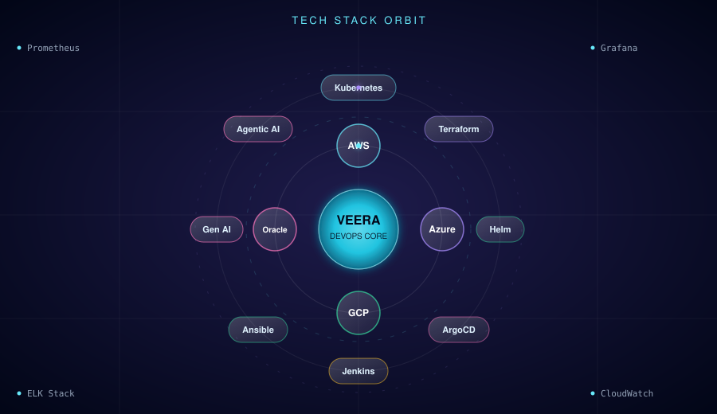
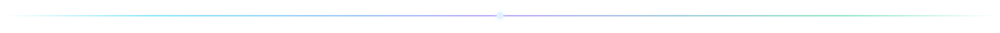

  

  

  

 

<!-- ============ GLASS CARD: ABOUT ============ -->

## 🪟 About

Senior DevOps & Multi-Cloud Architect with **15+ years** of industry experience across **AWS, Microsoft Azure, and Google Cloud Platform**. I design and operate production infrastructure for enterprise workloads, lead DevOps transformation initiatives, and build CI/CD pipelines that power mission-critical systems.

Alongside architecture work, I've trained **24,400+ engineers**, taking learners from foundational concepts to placement-ready skills at top MNCs and product companies. Every concept I teach is grounded in practices I use in production — not theory detached from real systems.

 

## 📊 By the Numbers

<table>
<tr>
<td align="center" width="150" style="background: rgba(34,211,238,0.06); backdrop-filter: blur(16px); border:1px solid rgba(148,163,184,0.25); border-radius:14px; padding:16px;">
<b>15+ Years</b> Experience
</td>
<td align="center" width="150" style="background: rgba(167,139,250,0.06); backdrop-filter: blur(16px); border:1px solid rgba(148,163,184,0.25); border-radius:14px; padding:16px;">
<b>24,400+</b> Engineers Trained
</td>
<td align="center" width="150" style="background: rgba(52,211,153,0.06); backdrop-filter: blur(16px); border:1px solid rgba(148,163,184,0.25); border-radius:14px; padding:16px;">
<b>3</b> Cloud Platforms
</td>
<td align="center" width="150" style="background: rgba(34,211,238,0.06); backdrop-filter: blur(16px); border:1px solid rgba(148,163,184,0.25); border-radius:14px; padding:16px;">
<b>35+</b> Live Projects
</td>
<td align="center" width="150" style="background: rgba(167,139,250,0.06); backdrop-filter: blur(16px); border:1px solid rgba(148,163,184,0.25); border-radius:14px; padding:16px;">
<b>Veera Cloud</b> Practice Environment
</td>
</tr>
</table>

 

<!-- ============ GLASS CARD: CURRENT FOCUS ============ -->

## 🎯 Current Focus

- 🏗️ **Architecting** a multi-cloud disaster recovery solution for a critical enterprise application
- 🔍 **Researching** service mesh technologies (Istio) and advanced FinOps strategies for cloud cost governance
- 🤖 **Building** agentic AI workflows for DevOps — LLM-driven incident response, autonomous remediation agents, and RAG-based infra assistants
- 🤝 **Open to collaboration** on cloud security, serverless frameworks, and Infrastructure-as-Code open-source projects
- 🧩 **Areas of expertise**: AWS, Azure, GCP, Kubernetes, Terraform, Ansible, CI/CD pipelines, cloud cost optimisation, Generative & Agentic AI

 

<!-- ============ GLASS CARD: GEN AI & AGENTIC AI ============ -->

## 🤖 Generative &amp; Agentic AI

Extending the DevOps craft into the AI layer — designing systems where LLMs and autonomous agents don't just assist engineers but actively operate infrastructure.

- **LLM App Architecture** — RAG pipelines, prompt/context engineering, and evaluation harnesses for production-grade LLM apps
- **Agentic Systems** — multi-agent orchestration (LangGraph, CrewAI-style patterns) for autonomous, tool-using workflows
- **AIOps** — LLM-powered log triage, anomaly detection, and self-healing pipeline automation
- **Vector & Retrieval Infra** — embeddings, vector databases, and hybrid search for grounding agents in real infrastructure data
- **MLOps for LLMs** — deployment, observability, and cost governance for model-serving pipelines on Kubernetes

`LangChain` `LangGraph` `RAG` `Vector DBs` `OpenAI` `Anthropic Claude` `Hugging Face` `AIOps`

 

## 🛠️ Technology Stack

 

<table>
<tr>
<td valign="top" width="50%" style="background: rgba(34,211,238,0.05); backdrop-filter: blur(18px); border:1px solid rgba(148,163,184,0.25); border-radius:16px; padding:18px;">

**☁️ Cloud Platforms**

**⚙️ DevOps & Orchestration**

</td>
<td valign="top" width="50%" style="background: rgba(167,139,250,0.05); backdrop-filter: blur(18px); border:1px solid rgba(148,163,184,0.25); border-radius:16px; padding:18px;">

**📈 Monitoring & Observability**

**💻 Programming & Scripting**

**🗄️ Databases**

**🤖 Generative & Agentic AI**

</td>
</tr>
</table>

 

## 🧭 Areas of Specialisation

<!-- nested glass: outer frosted shell wrapping a brighter inner glass table -->

| Area | Focus |
|---|---|
| **Project-Based Learning** | Every module built around real deployments, not slide decks |
| **Enterprise Cloud Architecture** | Production-grade infrastructure design across AWS, Azure, and GCP |
| **Kubernetes & Containers** | Docker, EKS, AKS, GKE, Helm, ArgoCD, and full GitOps workflows |
| **Infrastructure as Code** | Terraform, Ansible, OpenTofu — end-to-end automation |
| **AI & ML for DevOps** | KubeGPT, GitHub Copilot, AIOps, LLM-powered pipelines |
| **Generative & Agentic AI** | LLM app architecture, RAG pipelines, autonomous multi-agent systems for DevOps automation |
| **Cloud Security** | IAM, SSO, VPC hardening, zero-trust, and compliance architecture |
| **Observability** | Prometheus, Grafana, ELK Stack, CloudWatch — full-stack alerting |
| **Multi-Cloud Strategy** | Cost optimisation, cloud-native migration, hybrid governance |
| **Career Placement** | Engineers placed at Amazon, Microsoft, TCS, Infosys, Wipro, and startups |

 

## 🏅 Certifications

<table>
  <tr>
    <td align="center" width="200" style="background: rgba(34,211,238,0.06); backdrop-filter: blur(16px); border:1px solid rgba(148,163,184,0.25); border-radius:14px; padding:14px;">
      
       <b>AWS Certified Solutions Architect</b> 
      Amazon Web Services · Professional
    </td>
    <td align="center" width="200" style="background: rgba(167,139,250,0.06); backdrop-filter: blur(16px); border:1px solid rgba(148,163,184,0.25); border-radius:14px; padding:14px;">
      
       <b>Certified Kubernetes Administrator</b> 
      Linux Foundation / CNCF
    </td>
    <td align="center" width="200" style="background: rgba(52,211,153,0.06); backdrop-filter: blur(16px); border:1px solid rgba(148,163,184,0.25); border-radius:14px; padding:14px;">
      
       <b>Azure DevOps Engineer Expert</b> 
      Microsoft Azure
    </td>
    <td align="center" width="200" style="background: rgba(34,211,238,0.06); backdrop-filter: blur(16px); border:1px solid rgba(148,163,184,0.25); border-radius:14px; padding:14px;">
      
       <b>HashiCorp Terraform Associate</b> 
      HashiCorp
    </td>
  </tr>
  <tr>
    <td align="center" width="200" style="background: rgba(167,139,250,0.06); backdrop-filter: blur(16px); border:1px solid rgba(148,163,184,0.25); border-radius:14px; padding:14px;">
      
       <b>GCP Professional DevOps Engineer</b> 
      Google Cloud
    </td>
    <td align="center" width="200" style="background: rgba(52,211,153,0.06); backdrop-filter: blur(16px); border:1px solid rgba(148,163,184,0.25); border-radius:14px; padding:14px;">
      
       <b>Docker Certified Associate</b> 
      Docker Inc.
    </td>
    <td align="center" width="200" style="background: rgba(34,211,238,0.06); backdrop-filter: blur(16px); border:1px solid rgba(148,163,184,0.25); border-radius:14px; padding:14px;">
      
       <b>AWS Certified DevOps Engineer</b> 
      Amazon Web Services · Professional
    </td>
    <td align="center" width="200" style="background: rgba(167,139,250,0.06); backdrop-filter: blur(16px); border:1px solid rgba(148,163,184,0.25); border-radius:14px; padding:14px;">
      
       <b>Certified Kubernetes App Developer</b> 
      Linux Foundation / CNCF
    </td>
  </tr>
</table>

 

## 📈 GitHub Analytics

 

 

## 🚀 Featured Projects

**[Multi-Cloud CI/CD Pipeline](https://github.com/CloudTechDevOps/multi-cloud-cicd-pipeline)**
End-to-end CI/CD blueprint spanning AWS, Azure, and GCP with full automation.
`AWS` `Azure DevOps` `Jenkins` `Docker` `Kubernetes` `Terraform`
   

**[Serverless Data Lake on AWS](https://github.com/CloudTechDevOps/serverless-datalake-aws)**
Fully serverless data lake architecture on AWS, optimised for cost and performance.
`Lambda` `S3` `Glue` `Athena` `Python`
   

**[Kubernetes Cluster with GitOps](https://github.com/CloudTechDevOps/kubernetes-gitops-argocd)**
Production-grade Kubernetes cluster with a full GitOps workflow via ArgoCD.
`Kubernetes` `ArgoCD` `Helm` `Terraform` `GitHub Actions`
   

 

<!-- ============ GLASS CARD: WRITING ============ -->

## ✍️ Latest Writing

- [How to Deploy a Self-Hosted Agent in Azure Pipelines](https://medium.com/@veerababu.narni232/how-to-deploy-a-self-hosted-agent-in-azure-pipeline-c07a4f4ca4c4)
- [Querying Data in S3 with Amazon Athena](https://medium.com/@veerababu.narni232/querying-data-in-s3-with-amazon-athena-d9319eb87155)
- [Everything You Need to Know About AWS EKS Auto Mode](https://medium.com/@veerababu.narni232/everything-you-need-to-know-about-aws-eks-auto-mode-b5e03b49b630)
- [Centralising Cloud Networks: Deploying AWS Transit Gateway](https://medium.com/@veerababu.narni232/centralizing-secure-cloud-networks-hands-on-guide-to-deploying-aws-transit-gateway-1032221d4263)

 

<!-- ============ GLASS CARD: 2026 GOALS ============ -->

## 🎯 2026 Goals

- 🌱 Contribute to five or more significant open-source DevOps tools
- 🏆 Achieve the AWS Certified DevOps Engineer – Professional certification
- 🧑‍🏫 Mentor aspiring cloud engineers and grow the community
- 📝 Publish six or more in-depth technical articles on multi-cloud architecture and FinOps
- 🤖 Ship a production agentic-AI framework for autonomous cloud operations

 

<!-- ============ GLASS CARD: OSS ============ -->

## 🌐 Open Source Contributions

- **DevOps Tooling** — Pull requests for performance enhancements and bug fixes
- **Cloud-Native Projects** — Feature development for multi-cloud compatibility
- **Infrastructure-as-Code Modules** — Maintenance of widely-used Terraform modules for AWS resources

 

<i>"The best way to learn multi-cloud DevOps is to build real systems — not memorise commands."</i>
 
— Veerababu Narni

