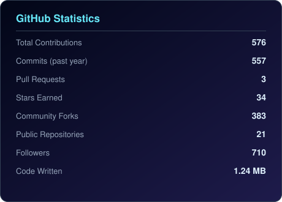
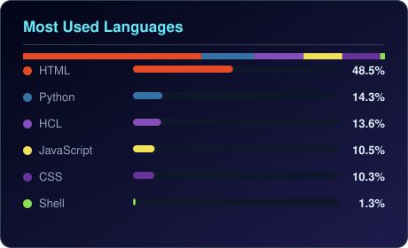

  

 

## 🪟 About

<table>
<tr>
<td width="140" align="center" valign="top">

</td>
<td valign="top">

Senior DevOps &amp; Multi-Cloud Architect with **15+ years** of industry experience across **AWS, Microsoft Azure, and Google Cloud Platform**. I design and operate production infrastructure for enterprise workloads, lead DevOps transformation initiatives, and build CI/CD pipelines that power mission-critical systems.

Alongside architecture work, I've trained **24,400+ engineers**, taking learners from foundational concepts to placement-ready skills at top MNCs and product companies. Every concept I teach is grounded in practices I use in production — not theory detached from real systems.

Everything in this account is a **working repository**: real Terraform that plans, real manifests that apply, real pipelines that run.

</td>
</tr>
</table>

 

## 📊 By the Numbers

<table>
<tr>
<td align="center" width="140"><b>15+ Years</b> Industry Experience</td>
<td align="center" width="140"><b>24,400+</b> Engineers Trained</td>
<td align="center" width="140"><b>3 Clouds</b> AWS · Azure · GCP</td>
<td align="center" width="140"><b>8</b> Certifications</td>
</tr>
<tr>
<td align="center" width="140"><b><!--STAT:FOLLOWERS-->710<!--/STAT:FOLLOWERS--></b> Followers</td>
<td align="center" width="140"><b><!--STAT:REPOS-->21<!--/STAT:REPOS--></b> Public Repositories</td>
<td align="center" width="140"><b><!--STAT:FORKS-->383<!--/STAT:FORKS--></b> Community Forks</td>
<td align="center" width="140"><b><!--STAT:STARS-->34<!--/STAT:STARS--></b> Stars Earned</td>
</tr>
</table>

<!-- stats last updated: 2026-09-19 -->

 

## 🎯 Current Focus

- 🏗️ **Architecting** a multi-cloud disaster recovery solution for a critical enterprise application
- 🔍 **Researching** service mesh technologies (Istio) and advanced FinOps strategies for cloud cost governance
- 🤖 **Building** agentic AI workflows for DevOps — LLM-driven incident response, autonomous remediation agents, and RAG-based infra assistants
- 🤝 **Open to collaboration** on cloud security, serverless frameworks, and Infrastructure-as-Code open-source projects
- 🧩 **Core expertise**: AWS, Azure, GCP, Kubernetes, Terraform, Ansible, CI/CD, cloud cost optimisation, Generative &amp; Agentic AI

 

## 🤖 Generative &amp; Agentic AI

> Extending the DevOps craft into the AI layer — designing systems where LLMs and autonomous agents don't just assist engineers, but actively operate infrastructure.

| Area | What I Build |
|---|---|
| **LLM App Architecture** | RAG pipelines, prompt/context engineering, evaluation harnesses for production LLM apps |
| **Agentic Systems** | Multi-agent orchestration (LangGraph, CrewAI-style patterns) for autonomous, tool-using workflows |
| **AIOps** | LLM-powered log triage, anomaly detection, self-healing pipeline automation |
| **Vector &amp; Retrieval Infra** | Embeddings, vector databases, hybrid search to ground agents in real infrastructure data |
| **MLOps for LLMs** | Deployment, observability, and cost governance for model-serving pipelines on Kubernetes |

 

## 🛠️ Technology Stack

 

<table>
<tr>
<td valign="top" width="50%">

**☁️ Cloud Platforms**

**⚙️ DevOps &amp; Orchestration**

**📈 Monitoring &amp; Observability**

</td>
<td valign="top" width="50%">

**💻 Programming &amp; Scripting**

**🗄️ Databases &amp; Caching**

**🤖 Generative &amp; Agentic AI**

</td>
</tr>
</table>

 

## 🧭 Areas of Specialisation

| Area | Focus |
|---|---|
| **Project-Based Learning** | Every module built around real deployments, not slide decks |
| **Enterprise Cloud Architecture** | Production-grade infrastructure design across AWS, Azure, and GCP |
| **Kubernetes &amp; Containers** | Docker, EKS, AKS, GKE, Helm, ArgoCD, and full GitOps workflows |
| **Infrastructure as Code** | Terraform, Ansible, OpenTofu — end-to-end automation |
| **AI &amp; ML for DevOps** | KubeGPT, GitHub Copilot, AIOps, LLM-powered pipelines |
| **Generative &amp; Agentic AI** | LLM app architecture, RAG pipelines, autonomous multi-agent systems |
| **Cloud Security** | IAM, SSO, VPC hardening, zero-trust, and compliance architecture |
| **Observability** | Prometheus, Grafana, ELK Stack, CloudWatch — full-stack alerting |
| **Multi-Cloud Strategy** | Cost optimisation, cloud-native migration, hybrid governance |
| **Career Placement** | Engineers placed at Amazon, Microsoft, TCS, Infosys, Wipro, and startups |

 

## 🚀 Featured Repositories

Real, runnable repositories from this account — ordered by how much the community actually uses them.

| Repository | What It Is | Stack | Forks |
|---|---|---|:--:|
| **[Linux-commands](https://github.com/CloudTechDevOps/Linux-commands)** | Practical Linux command reference for DevOps engineers — the most forked repo here | `Linux` `Bash` | 110 |
| **[aws-ecomerce-Application-Multiple-services](https://github.com/CloudTechDevOps/aws-ecomerce-Application-Multiple-services)** | Multi-storefront e-commerce app: Flask API + 9 static frontends, with architecture and flow diagrams | `Python` `Flask` `AWS` `Nginx` | 29 |
| **[veera-ops](https://github.com/CloudTechDevOps/veera-ops)** | Training portfolio site, containerised and shipped via Azure Pipelines to a custom domain | `HTML` `Docker` `Azure Pipelines` | 26 |
| **[Kubernetes-0900](https://github.com/CloudTechDevOps/Kubernetes-0900)** | 19-day hands-on EKS course: pods to RBAC, HPA, VPC-CNI, StatefulSets, Helm, ArgoCD, IRSA | `Kubernetes` `Helm` `EKS` | 24 |
| **[Kubernetes-1030](https://github.com/CloudTechDevOps/Kubernetes-1030)** | Parallel Kubernetes track — services, autoscaling, ArgoCD, path-based ingress, Helm charts | `Kubernetes` `Helm` `ArgoCD` | 20 |
| **[python-backend-testing](https://github.com/CloudTechDevOps/python-backend-testing)** | Six Flask backend variants compared: plain, read-replica, Secrets Manager, ElastiCache, Nginx LB | `Python` `Flask` `RDS` `Redis` | 18 |
| **[lambda-](https://github.com/CloudTechDevOps/lambda-)** | Library of standalone AWS Lambda handlers: EC2, S3, RDS, CloudFront, CloudWatch log export | `Python` `boto3` `Lambda` | 18 |
| **[Azure-app-service-deployment](https://github.com/CloudTechDevOps/Azure-app-service-deployment)** | Flask app deployed to Azure App Service through GitHub Actions | `Python` `Azure` `Actions` | 15 |
| **[Azure-3-tier-terraform-deployment](https://github.com/CloudTechDevOps/Azure-3-tier-terraform-deployment)** | Modular 3-tier Azure architecture in Terraform — bastion, frontend/backend VM + VMSS, LBs, database | `Terraform` `Azure` | 13 |
| **[azure-funation-app](https://github.com/CloudTechDevOps/azure-funation-app)** | Azure Functions Python **v1** model — `function.json` bindings per function folder | `Python` `Azure Functions` | 12 |
| **[2nd10WeeksofCloudOps-main](https://github.com/CloudTechDevOps/2nd10WeeksofCloudOps-main)** | Full-stack bookstore: React client + Node/Express API + MySQL, with Terraform EKS modules, K8s manifests and Jenkins pipelines | `React` `Node` `Terraform` `EKS` | 11 |
| **[azure-function](https://github.com/CloudTechDevOps/azure-function)** | Azure Functions Python **v2** model — decorator-based `function_app.py`, deployed by Actions | `Python` `Azure Functions` | 11 |
| **[gcp-iam](https://github.com/CloudTechDevOps/gcp-iam)** | GCP IAM reference: resource hierarchy, roles, bindings, service accounts, least privilege | `GCP` `IAM` | 7 |
| **[Terraform0730](https://github.com/CloudTechDevOps/Terraform0730)** | Day-by-day Terraform curriculum on AWS — providers, custom VPC, remote state + locking, RDS, lifecycle, root/child modules | `Terraform` `AWS` | 6 |
| **[GCP-Terraform](https://github.com/CloudTechDevOps/GCP-Terraform)** | Terraform on GCP, including a static site bucket deployment | `Terraform` `GCP` | 5 |
| **[sample_nodejs_on_Ec2](https://github.com/CloudTechDevOps/sample_nodejs_on_Ec2)** | Minimal Node.js service containerised for EC2 deployment | `Node.js` `Docker` `EC2` | 5 |
| **[docker_python_flask-project](https://github.com/CloudTechDevOps/docker_python_flask-project)** | Dockerised Flask app with multiple Azure Web App deployment workflows plus EC2/Nginx notes | `Python` `Docker` `Azure` | 4 |
| **[gcp-cloud-run-funation-deployment](https://github.com/CloudTechDevOps/gcp-cloud-run-funation-deployment)** | Containerised Flask service deployed to Google Cloud Run | `Python` `Cloud Run` | 4 |
| **[onlinebookstore](https://github.com/CloudTechDevOps/onlinebookstore)** | Java JSP/Servlet bookstore (fork) wired up with Jenkins, CodeBuild and CodeDeploy | `Java` `Maven` `Tomcat` | 7 |
| **[git-branch](https://github.com/CloudTechDevOps/git-branch)** | Sandbox for practising git branching and pull-request workflow | `Python` `Git` | 0 |

 

## 📈 GitHub Analytics

  

  

 

## 🏅 Certifications

<table>
  <tr>
    <td align="center" width="200">
      
       <b>AWS Solutions Architect</b> Amazon Web Services · Professional
       ✅ <a href="https://www.credly.com/badges/ff07c2a6-a093-44fd-acc7-8534995f2dca">Verify</a>
    </td>
    <td align="center" width="200">
      
       <b>Kubernetes Administrator (CKA)</b> Linux Foundation / CNCF
       ✅ <a href="https://www.credly.com/badges/afe77f2b-843a-413c-925d-4c8ea7891503">Verify</a>
    </td>
    <td align="center" width="200">
      
       <b>Azure DevOps Engineer Expert</b> Microsoft Azure
    </td>
    <td align="center" width="200">
      
       <b>Terraform Associate</b> HashiCorp
    </td>
  </tr>
  <tr>
    <td align="center" width="200">
      
       <b>AWS DevOps Engineer</b> Amazon Web Services · Professional
    </td>
    <td align="center" width="200">
      
       <b>Kubernetes App Developer (CKAD)</b> Linux Foundation / CNCF
    </td>
    <td align="center" width="200">
      
       <b>GCP Professional DevOps Engineer</b> Google Cloud
    </td>
    <td align="center" width="200">
      
       <b>Docker Certified Associate</b> Docker Inc.
    </td>
  </tr>
</table>

 

## ✍️ Latest Writing

- [How to Deploy a Self-Hosted Agent in Azure Pipelines](https://medium.com/@veerababu.narni232/how-to-deploy-a-self-hosted-agent-in-azure-pipeline-c07a4f4ca4c4)
- [Querying Data in S3 with Amazon Athena](https://medium.com/@veerababu.narni232/querying-data-in-s3-with-amazon-athena-d9319eb87155)
- [Everything You Need to Know About AWS EKS Auto Mode](https://medium.com/@veerababu.narni232/everything-you-need-to-know-about-aws-eks-auto-mode-b5e03b49b630)
- [Centralising Secure Cloud Networks: Deploying AWS Transit Gateway](https://medium.com/@veerababu.narni232/centralizing-secure-cloud-networks-hands-on-guide-to-deploying-aws-transit-gateway-1032221d4263)

 

## 🎯 2026 Goals

- 🌱 Contribute to five or more significant open-source DevOps tools
- 🧑‍🏫 Mentor aspiring cloud engineers and grow the community
- 📝 Publish six or more in-depth technical articles on multi-cloud architecture and FinOps
- 🤖 Ship a production agentic-AI framework for autonomous cloud operations
- 📚 Bring every repository in this account to production-grade documentation

 

## 🤝 Open Source &amp; Collaboration

- **DevOps Tooling** — pull requests for performance enhancements and bug fixes
- **Cloud-Native Projects** — feature development for multi-cloud compatibility
- **Infrastructure-as-Code Modules** — maintenance of reusable Terraform modules for AWS resources
- **Teaching Repositories** — the course repos above are open to issues and PRs; corrections welcome

 

  

<i>"The best way to learn multi-cloud DevOps is to build real systems — not memorise commands."</i>
 
— Veerababu Narni

